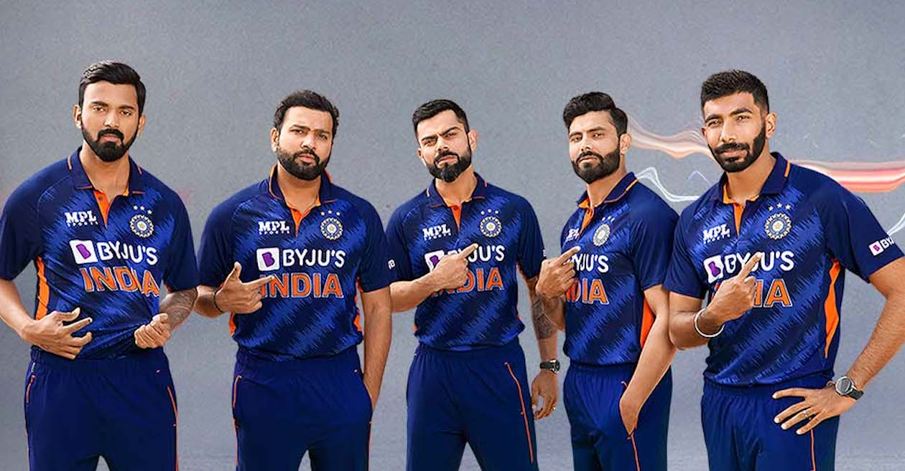

# ***Single and Multiple Face Detection*** 

## Overview : 
This project demonstrates how to detect single and multiple human faces in images using **OpenCV's Haar Cascade Classifier**. 
It shows the ability of classical computer vision techniques to localize faces by drawing bounding boxes around them.

## Technologies Used :
- **Python**
- **OpenCV**
- **NumPy**
- **Google Colab / Jupyter Notebook**

## How It Works :
1. Load the pre-trained Haar Cascade model:  
   `haarcascade_frontalface_default.xml`
2. Convert the input image to grayscale for better detection.
3. Use `detectMultiScale()` to identify face regions.
4. Draw rectangles around detected faces to visualize results.
5. Display the processed image using `cv2_imshow()`.

## Results :
- **Single Face Detection:** Successfully detected one face in a portrait image.
- **Multiple Face Detection:** Detected multiple faces accurately in a group photo.

Both results were visualized using OpenCV with bounding boxes over each detected face.

### Input Images
| Single Face | Multiple Faces |

|  |  |

### Output Images
| Single Face Detected | Multiple Faces Detected |

|  |  |

